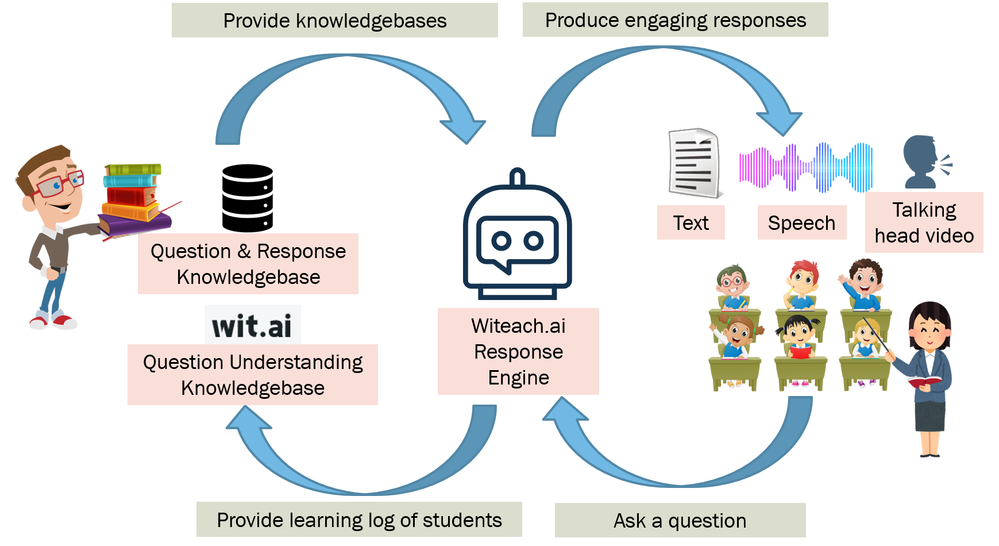

# Welcome to Witeach.ai!

This project brings person-feel responses to chatbot. This is achieved by leveraging the natural language understanding technology powered by Wit.ai (http://wit.ai) and lip sync technology (https://github.com/Rudrabha/Wav2Lip).

In this repo, we demostrate how Witeach.ai can empower education: 1) training students’ basic questioning skills, 2) increasing the accessibility of learning from best teachers for students, and 3) providing more engaging talking head responses when compared with simple text response.

# Installation
1. Clone the project
 `git clone https://github.com/pacowong/witeachai.git`
 1. Clone the Wav2Lip project
  `git clone https://github.com/Rudrabha/Wav2Lip`
  1. Merge the Wav2Lip project with `eduai_suite/Wav2Lip` folder
  2. Install Wav2Lip following the instruction given in Wav2Lip project
  3. To install the packages to run the Witeach.ai server, go to`eduai_suite/eduai_server` and run `pip install -r requirements.txt`

# Linking to Your Wit.ai App
  1. Download SQLite Browser from https://sqlitebrowser.org/
  2. Using the browser, you can edit the configuration in the `chatbot_proj` table of `eduai_suite/eduai_server/instance/eduai_data.sqlite` database.
  3. The `token` is the client token of your Wit.ai app while `proj_name` is a project identifier used by the Witeach.ai engine.

# Update Responses
Suppose you hava already develop your app on Wit.ai. Your `proj_name` set in the database is `big_cat_fact_proj`
1. You can update the responses from `eduai_suite/eduai_server/instance/big_cat_fact_proj/responses`. Each file corresponds to one intent. Such file can be opened via Microsoft Excel. Each row represents one possible combinations of the entities.
2. Then you need to configure the response compilation tools. You should edit the first few lines for the inputs and output directories in `eduai_suite/eduai_server/compile_talk_videos.py` 
3. Lastly, you can compile the talking head responses using `python compile_talk_videos.py`

# System Flow for Classroom Chatbot via Witeach.ai

